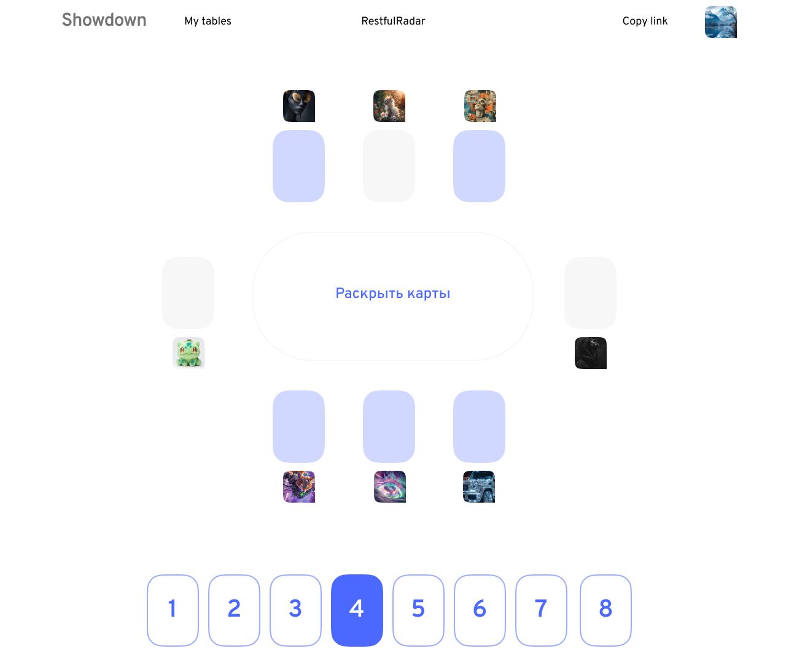
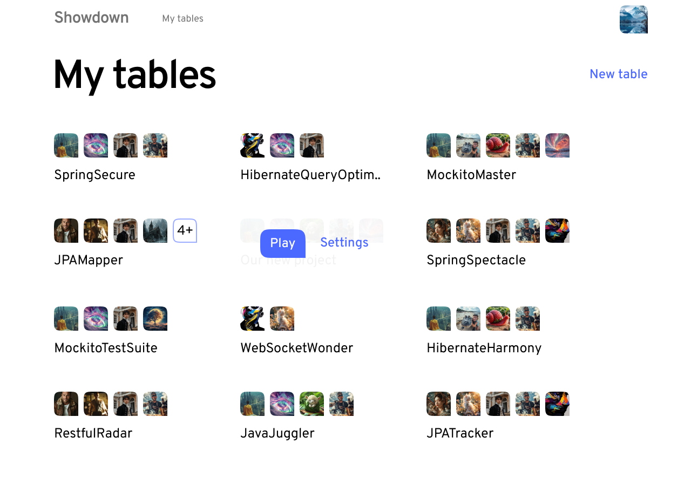

# Showdown

Showdown is a RESTful Spring Boot application for planning poker.

<p align="center">
  
</p>

<p align="center">
  
</p>

# Contents
1. [Features](#features)
2. [Getting started](#getting-started)
   1. [Running Locally](#running-locally)
        1. [Prerequisites](#prerequisites)
        2. [Installation](#installation)
3. [API Documentation](#api-documentation)
4. [Authors](#authors)
5. [License](#license)

# Getting started

## Running locally
### Prerequisites
Ensure you have the following installed on your local machine:
- Java 17 or later
- Maven

### Installation

1. Clone the repository to your local machine.
2. Navigate to the project directory.
3. Run this command to build the project:
   ```bash
   mvn clean install
   ```
4. Ensure your PostgreSQL server is running.
5. Run these commands to generate RSA keys:
   ```bash
   cd src/main/resources/certs
   openssl genrsa  -out keypair.pem 2048
   openssl rsa  -in keypair.pem  -pubout  -out public.pem
   openssl pkcs8  -topk8  -inform PEM  -outform PEM  -nocrypt  -in keypair.pem  -out private.pem
   ```
5. Run `mvn spring-boot:run` to start the application.

# API documentation
The API documentation for Showdown is accessible when you run the application. It can be viewed at http://localhost:8080/swagger-ui/index.html#/. This documentation provides insights into the endpoints, the structure of requests/responses, and status codes.

# Authors
Pavel Sulavko https://github.com/SulavkoPavel 

Roman Kryukoff https://github.com/roman-develops

# License
This project is licensed under [Apache License, Version 2.0](https://www.apache.org/licenses/LICENSE-2.0).